# dora-studio

dora-studio is a **local web-based GUI** for visualizing, running, and
debugging [dora-rs](https://github.com/dora-rs/dora) applications. It is
not a replacement for the dora CLI — it is a companion Studio that lets
you see dataflow structure, runtime status, logs, robot visualization,
and type safety in one browser window.

- **See before you run**: open any dataflow YAML as a node/edge graph,
  with real port types and live compatibility checking
- **Edit safely**: modify dataflows on a canvas and write changes back
  with surgical diff patches — comments and unknown fields are preserved
  and every write-back is backed up
- **Trust but verify**: `dora validate` runs as the final gate on every
  save; errors are mapped back onto the canvas
- **Zero-terminal daily ops**: start/stop the dora session, run
  dataflows, record frame streams, and switch dora versions from the UI
- **Robot views**: MuJoCo-based 3D viewport, motion planner console,
  metrics and flame graphs

> **dora version**: typed features require **dora 1.x** (tested with
> 1.0.0-rc.4). dora 0.5 works in a degraded mode (no typed validation,
> no version switching); the Dashboard shows a compatibility badge.

---

## Table of contents

1. [Modules at a glance](#modules-at-a-glance)
2. [Prerequisites](#prerequisites)
3. [Running the Studio](#running-the-studio)
4. [Quick start](#quick-start)
5. [Dashboard](#dashboard)
6. [Dataflow Explorer 2.0](#dataflow-explorer-20)
7. [Run & Monitor](#run--monitor)
8. [Logs & Events](#logs--events)
9. [Visualization](#visualization)
10. [Motion Planner](#motion-planner)
11. [Monitoring & Metrics](#monitoring--metrics)
12. [Replay (.drec)](#replay-drec)
13. [Type system reference](#type-system-reference)
14. [Configuration](#configuration)
15. [Backend API surface](#backend-api-surface)
16. [Examples](#examples)
17. [Validation](#validation)
18. [Known limitations](#known-limitations)
19. [Troubleshooting](#troubleshooting)

---

## Modules at a glance

| Module (sidebar) | What it does | How you use it |
|---|---|---|
| **Dashboard** | Session control (dora up/down), dora version manager, quick start | One-click buttons; pick an installed dora version from the environment card |
| **Dataflow Explorer 2.0** | Real project scanning, canvas editing, type checking, safe save | Add your project directory, open a dataflow, edit ports/types, Save |
| **Run & Monitor** | Run/stop dataflows, custom YAML path, frame-stream recording | Press Run, record frames, open recordings in Replay |
| **Logs & Events** | Three-level log viewer + raw stream | Drill into info/warning/error per dataflow |
| **Visualization** | 3D viewport (MuJoCo models), dviz status | Inspect the robot model, pan/zoom/orbit |
| **Motion Planner** | Planning console (read-only mirror in this version) | View joint state and planning status |
| **Monitoring & Metrics** | Per-node metrics, OTel flame graphs | Enable monitoring on demand; inspect spans |
| **Replay** | .drec frame-stream replay with timeline | Open a recording, scrub the timeline |

---

## Prerequisites

- **Rust 1.75** (edition 2021) — backend build
- **Node.js + npm** — frontend build (Vue 3 + Vite + TypeScript)
- **dora CLI** — dora 1.x strongly recommended. The Studio resolves the
  binary in this order: `DORA_STUDIO_DORA_BIN` env → settings file →
  `$PATH`. On first launch the Dashboard shows which version was found
  and whether it is fully supported.
- **Python venv with pyarrow** — dataflow nodes spawned by the dora
  daemon run in this environment, so the venv must be active (or on
  `PATH`) when starting the backend. Example:

```bash
python3 -m venv ~/.venvs/dora-studio-1.0
~/.venvs/dora-studio-1.0/bin/pip install dora-rs pyarrow
```

---

## Running the Studio

```bash
# Terminal 1 — backend (port 127.0.0.1:3001)
export VIRTUAL_ENV=~/.venvs/dora-studio-1.0
export PATH="$VIRTUAL_ENV/bin:$PATH"
cargo run --manifest-path backend/Cargo.toml

# Terminal 2 — frontend (http://localhost:5173)
npm --prefix frontend run dev
```

Environment overrides:

| Variable | Default | Purpose |
|---|---|---|
| `DORA_STUDIO_BACKEND_ADDR` | `127.0.0.1:3001` | Backend listen address |
| `DORA_STUDIO_DORA_BIN` | (settings → PATH) | Force a specific dora CLI binary |
| `DORA_STUDIO_SETTINGS` | `~/.config/dora-studio/settings.json` | Settings file location |
| `DORA_STUDIO_OTLP_ADDR` | `127.0.0.1:4318` | OTLP HTTP receiver |
| `DORA_STUDIO_OTLP_GRPC_ADDR` | `127.0.0.1:4317` | OTLP gRPC receiver |

---

## Quick start

1. Start the backend and frontend (see above), open
   http://localhost:5173.
2. On the **Dashboard**, confirm the dora version badge is compatible
   (1.x), then press **Start session** — this runs `dora up`.
3. Open **Dataflow Explorer**. The built-in `Studio Examples` group
   lists the example dataflows. Click one to open it on the canvas.
4. Select a node and set port types with the **Port types** panel —
   edges turn green/yellow/red/gray in real time.
5. Press **Save** — the file is patched in place (with a backup), and
   `dora validate` runs before anything is written.
6. Go to **Run & Monitor** and press **Run** on the same dataflow to
   see it execute, with logs in **Logs & Events**.

---

## Dashboard

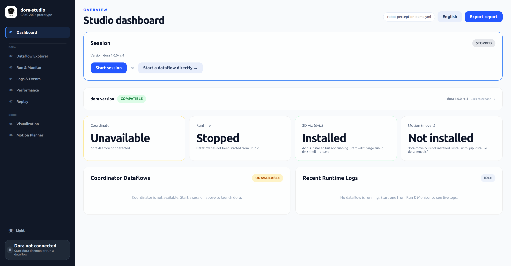

- **Session control**: Start/Stop maps to `dora up` / `dora down`. The
  status reflects coordinator reachability, so sessions started outside
  the Studio are also visible and can be stopped. A global **Stop
  session** button sits in the bottom-left corner of every page.
- **Dora version manager**: the environment card lists all detected dora
  installations (env override, `$PATH`, `~/.local/bin`, `~/.venvs/*`),
  marks the active one, and shows a compatibility badge (1.x = full
  support, 0.5 = degraded). Click a candidate to hot-switch — the choice
  is persisted in the settings file and takes effect immediately.

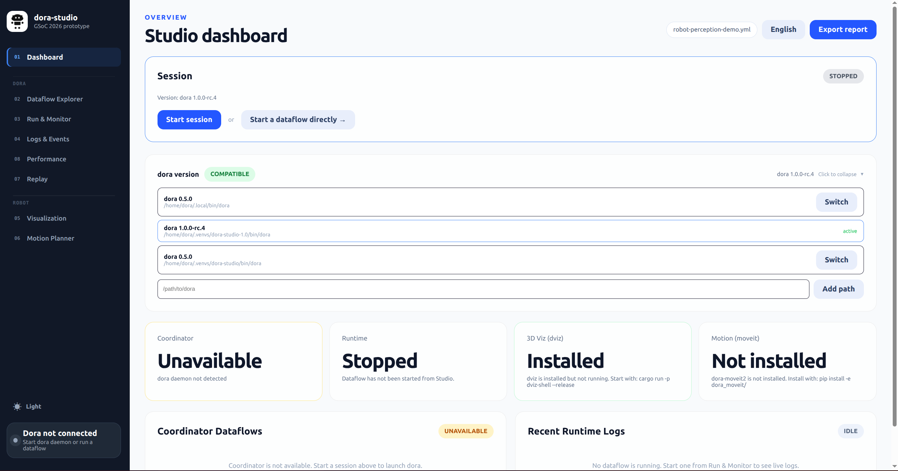

---

## Dataflow Explorer 2.0

The Explorer is the heart of the Studio: it scans **your real projects**
and turns every dataflow into an editable, type-checked canvas.

### Projects & palette

- The sidebar lists dataflows grouped by project. `Studio Examples`
  (the bundled `examples/` directory) is always present; add your own
  directories with **＋ Add project directory**. Project directories are
  persisted in the settings file (`projectDirs`). A directory that no
  longer exists shows a "(directory missing)" note and can be removed
  with the ✕ button.
- Every node found in your YAML files (with its ports and declared type
  URNs) enters the **node palette**, deduplicated across projects.
  Nodes that exist only as standalone scripts can be registered manually
  with **+ Add node manually** (they are marked as `manual` in the UI).

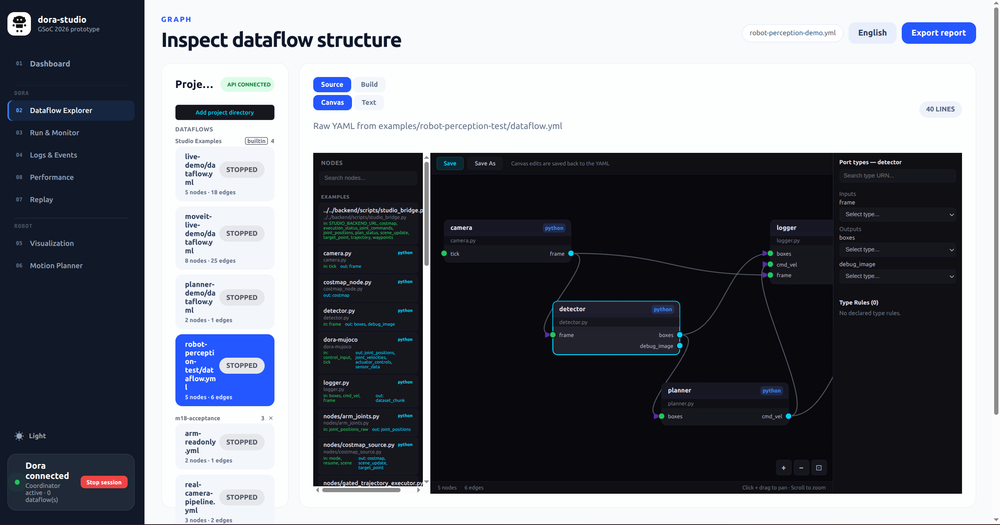

### Source tab: canvas editing

Clicking a dataflow opens it on the canvas (Canvas / Text sub-views):

- Nodes, ports, and type declarations come from the real file
  (`input_types` / `output_types` / `type_rules`).
- **Port types panel**: pick type URNs from the vendored dora 1.0 std
  catalog (27 types, grouped and searchable).
- **Edges are checked live** against dora's own compatibility semantics
  (see [Type system reference](#type-system-reference)): green =
  compatible, yellow = compatible via a declared `type_rules` rule, red
  = incompatible, gray = type not declared on one or both ports.
- A red edge shows the reason and a suggested fix; one click on
  **Declare type rule** writes the `type_rules` declaration for you
  (managed in the **Type Rules** panel).
- Files that cannot be parsed fall back to a read-only text view with an
  honest note — the canvas never fakes content.

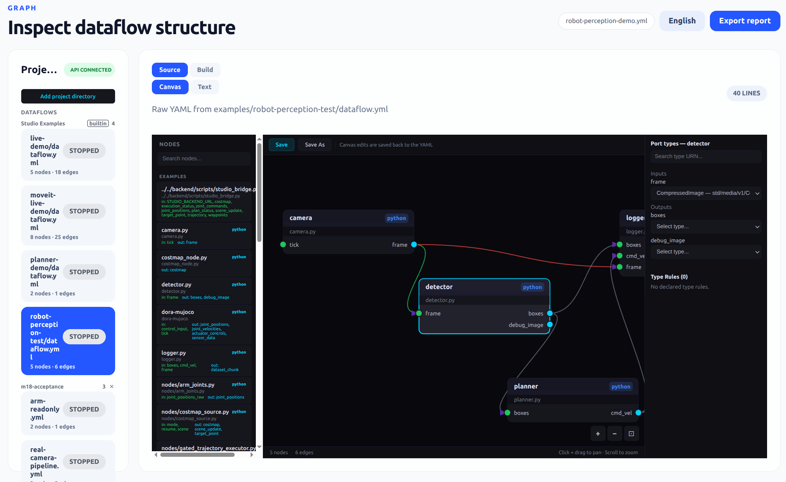
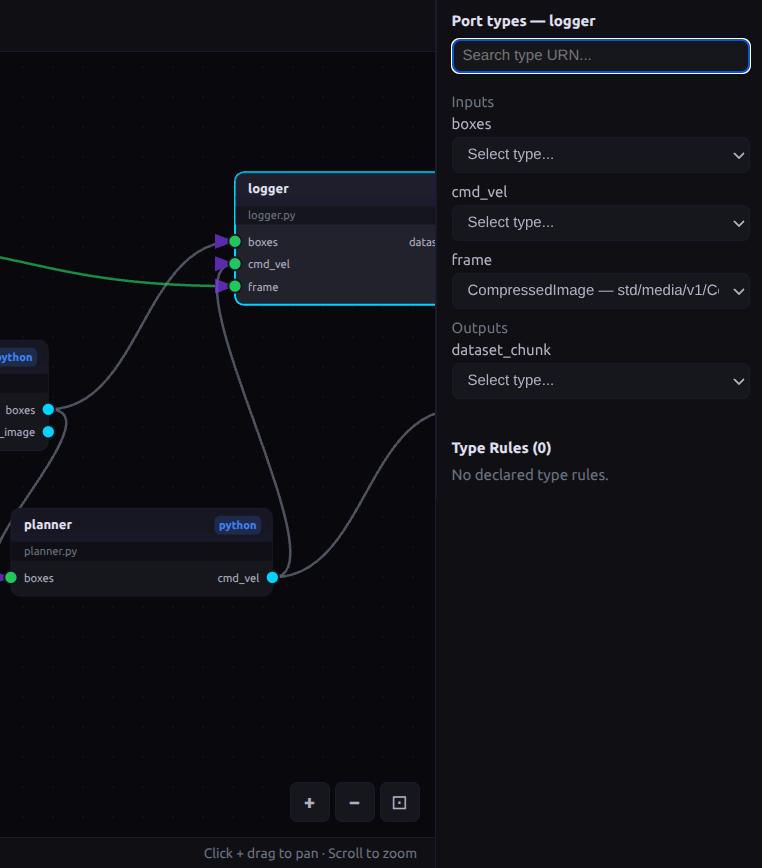
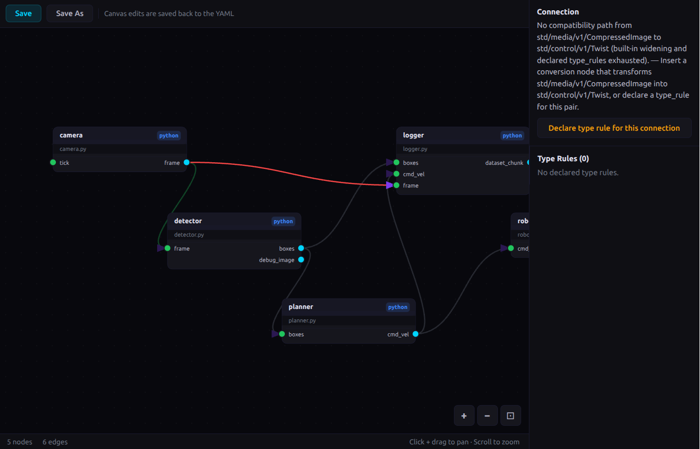

### Saving

- **Save** patches the original file: only node blocks and `type_rules`
  are rewritten; comments, `env:`, and any unknown sections are
  preserved verbatim. Before writing, the previous file is backed up to
  `~/.config/dora-studio/backups/`.
- **Save As** generates a fresh dataflow YAML at any path you choose.
- Both actions run **`dora validate` as the final gate** (10 s timeout):
  errors block the save and are mapped back onto the offending
  nodes/edges on the canvas; warnings do not block and are shown as
  yellow highlights.

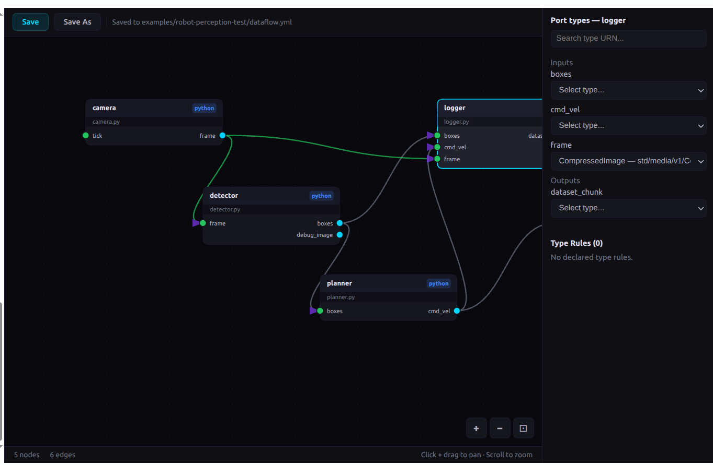

### Build tab

The Build tab remains for creating new dataflows from scratch: drag
nodes from the (now real) palette, connect ports, generate YAML,
validate, and run.

---

## Run & Monitor

- **Run / Stop** dataflows through the coordinator (`dora start` /
  `dora stop` with a Studio-managed name), including dataflows from any
  project directory. A custom YAML path can be entered directly.
- **Record**: captures the dataflow's frame stream to
  `out/recordings/<timestamp>.drec`. Stop the recording and open it in
  the Replay timeline from the recordings list.

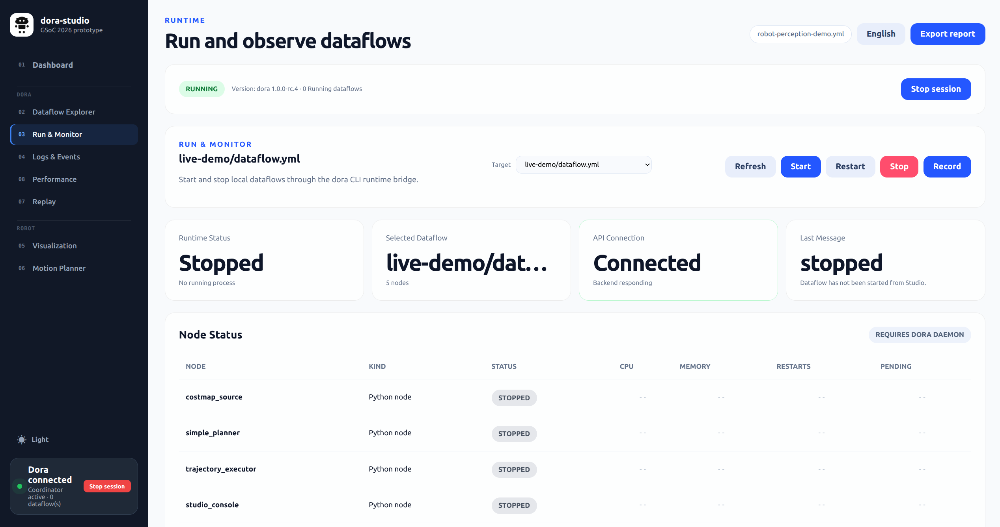

---

## Logs & Events

Three-level log viewer (info / warning / error with distinct visuals)
plus a raw stream, cross-referenced with the running dataflow.

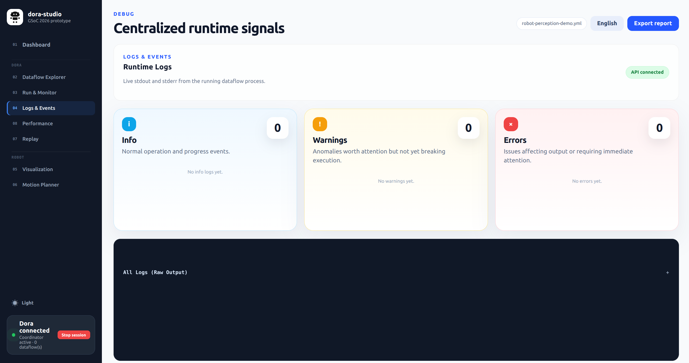

---

## Visualization

3D viewport rendering the MuJoCo robot model (shared `NanoRobotViewer`):
orbit/pan/zoom, dviz and MoveIt status indicators, and replay overlay
integration for recorded frame streams.

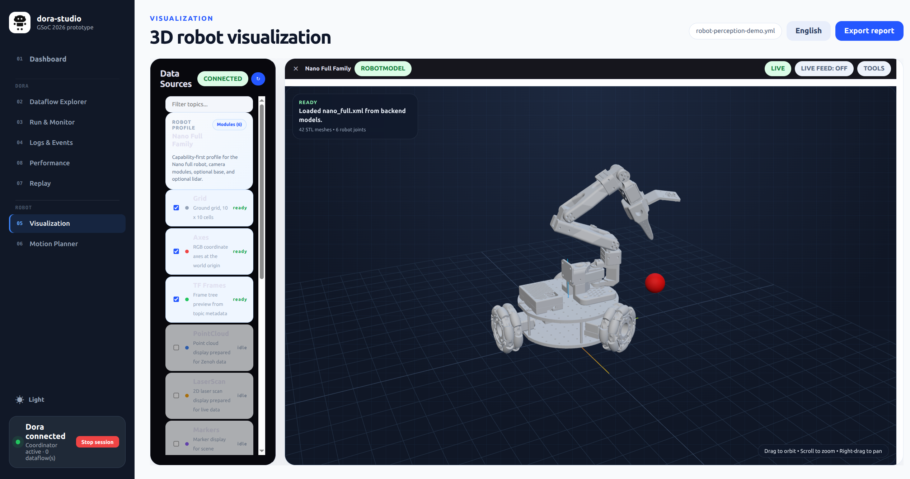

---

## Motion Planner

A planning console view. In this version it is a read-only mirror of the
planning state (the actual planning/execution runs on the MoveIt side);
Plan/Execute controls are disabled and clearly labeled.

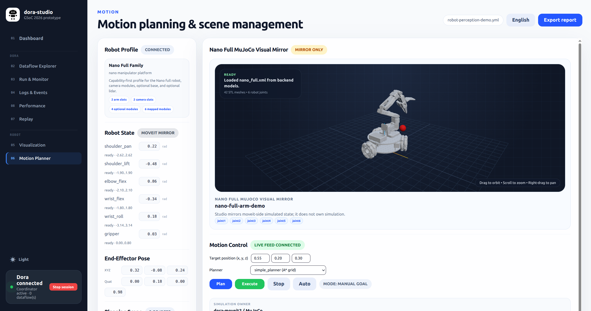

---

## Monitoring & Metrics

- **Monitoring control**: on-demand toggle (off by default). When
  enabled, per-node metrics are polled from the dora daemon (WebSocket
  source with CLI fallback).
- **OTel flame graphs**: spans are received over OTLP (HTTP on 4318,
  gRPC on 4317) and rendered as flame graphs. Point `DORA_OTLP_ENDPOINT`
  at the Studio receiver to profile your nodes.

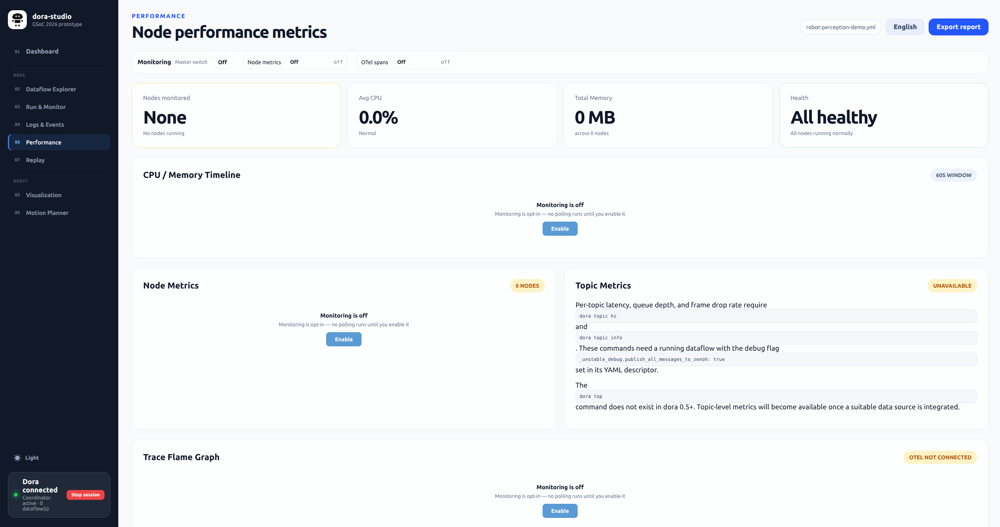

---

## Replay (.drec)

Open a `.drec` recording, scrub the timeline, and watch the 3D viewport
and attribution bar follow the recorded frames (frame-stream replay with
an own offset index — no dora dependency for seeking).

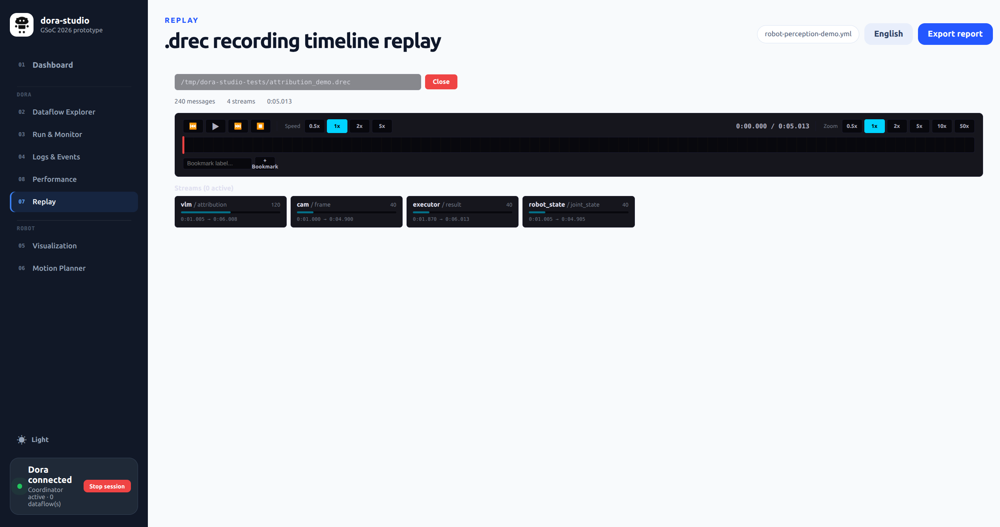

---

## Type system reference

The Explorer checks port compatibility with the **same semantics as
dora 1.0** (replicated locally, cross-validated against
`dora validate`):

| Edge color | Meaning |
|---|---|
| 🟢 green | Compatible: identical URNs, built-in numeric widening (`UInt8→UInt32→UInt64`, `Int32→Int64`, `Float32→Float64`), or the universal `* → std/core/v1/Bytes` sink |
| 🟡 yellow | Compatible only via a user-declared `type_rules` rule (BFS depth ≤ 3, same as dora) |
| 🔴 red | Incompatible — the tooltip explains why (e.g. struct field missing) and suggests inserting a conversion node |
| ⚪ gray | No type URN declared on one or both ports — declare types to enable checking |

Struct types are compared field-by-field (actual fields must be a
superset of expected; field order is irrelevant). Parameterized URNs
(e.g. `std/media/v1/AudioFrame[sample_type=f32]`) are supported.

**Honest boundary**: declarations make a connection *valid*; they never
convert data. dora passes data unchanged between nodes, so Studio never
rewrites types for you — it suggests inserting a real conversion node
instead. The vendored type catalog lives in `backend/assets/types/`
(copied verbatim from dora 1.0.0-rc.4, 27 types across
core/math/control/media/vision).

---

## Configuration

`~/.config/dora-studio/settings.json` (seeded on first run):

```json
{
  "doraBin": "/path/to/dora-1.0/bin/dora",
  "candidates": ["/path/one/dora", "/path/two/dora"],
  "projectDirs": ["/home/me/my-dora-project"],
  "manualNodes": [
    {
      "id": "my-converter",
      "path": "/home/me/scripts/convert.py",
      "description": "",
      "inputs":  [{ "name": "image", "urn": "std/media/v1/Image" }],
      "outputs": [{ "name": "image", "urn": "std/media/v1/Image" }]
    }
  ]
}
```

| Field | Purpose |
|---|---|
| `doraBin` | Active dora CLI (set by the version manager) |
| `candidates` | Detected dora installations shown in the environment card |
| `projectDirs` | User project directories scanned by the Explorer |
| `manualNodes` | Manually registered palette nodes |

---

## Backend API surface

```
GET    /api/health                      GET    /api/coordinator/status
GET    /api/system/status               GET    /api/session/status
POST   /api/session/start               POST   /api/session/stop
GET    /api/daemon/status               POST   /api/daemon/start
POST   /api/daemon/stop
GET    /api/dora/versions               POST   /api/dora/switch
POST   /api/dora/candidates/add         POST   /api/dora/candidates/delete
GET    /api/dataflows                   POST   /api/dataflows/:id/save
POST   /api/dataflows/save-as
GET    /api/dataflows/:id/definition    GET    /api/dataflows/:id/graph
GET    /api/dataflows/:id/nodes         GET    /api/dataflows/:id/logs
POST   /api/dataflows/:id/start         POST   /api/dataflows/:id/stop
POST   /api/dataflows/:id/restart
POST   /api/dataflow/build              POST   /api/dataflow/parse
POST   /api/dataflow/validate           POST   /api/dataflow/run
GET    /api/projects/list               POST   /api/projects/add
POST   /api/projects/delete             POST   /api/projects/nodes
GET    /api/palette
GET    /api/types/catalog               GET    /api/types/:urn
POST   /api/schema/check                GET    /api/schema/operator/:name
GET    /api/runtime/status              GET    /api/runtime/logs
POST   /api/runtime/start               POST   /api/runtime/start-path
POST   /api/runtime/stop                 GET    /api/runtime/nodes/:dataflow_id
POST   /api/recording/capture           POST   /api/recording/stop
GET    /api/recording/list              GET    /api/recording/open
GET    /api/recording/:id/entries       GET    /api/recording/:id/streams
GET    /api/recording/:id/seek          GET    /api/recording/:id/attribution
POST   /api/recording/:id/close
GET    /api/metrics/nodes               GET    /api/metrics/nodes/:id/history
GET    /api/monitoring/status           POST   /api/monitoring/toggle
GET    /api/otel/status                 GET    /api/otel/spans
GET    /api/otel/trace/:trace_id
GET    /api/dviz/status                 GET    /api/dviz/topics
GET    /api/dviz/displays               GET    /api/dviz/snapshot
GET    /api/moveit/status               GET    /api/moveit/snapshot
GET    /api/robot/profile               GET    /api/models
GET    /api/lerobot/status              GET    /api/lerobot/profiles
GET    /api/lerobot/scan                GET    /api/lerobot/autodetect
GET    /api/lerobot/frames              GET    /api/lerobot/attribution
GET    /api/live/recent                 POST   /api/live/ingest
POST   /api/live/command
```

---

## Examples

Bundled example dataflows (scanned into `Studio Examples`):

- `robot-perception-test` — camera → detector → planner → logger pipeline
- `live-demo` — costmap source, planner, trajectory executor
- `moveit-live-demo` — arm joints, IK solver, planning scene, MoveIt console
- `planner-demo` — planner demo flow

To test the Explorer against real hardware-style projects, point it at
any directory of your own dataflows via **＋ Add project directory**.

---

## Validation

```bash
cargo test --manifest-path backend/Cargo.toml   # 294 unit + 1 integration
npm --prefix frontend run test:tools            # pure-logic tools suites
npm --prefix frontend run build                 # vue-tsc + vite
cargo fmt --manifest-path backend/Cargo.toml --check
git diff --check
```

Note: the backend test suite must run while no Studio backend is
running (the OTLP receiver tests bind ports 4317/4318).

---

## Known limitations

- **No runtime data conversion**: type declarations validate a
  connection; dora forwards data unchanged. Insert a conversion node
  when formats differ (Studio suggests it but never fakes it).
- **Motion Planner** is a read-only console in this version; planning
  and execution live on the MoveIt side.
- **dora 0.5** is supported in degraded mode only (no typed validation,
  no version manager benefits).
- Per-node CPU/memory metrics require the dora daemon; when the daemon
  is unreachable the Studio falls back to CLI status queries.
- Dataflows using dora's `operator: {python: module:Class}` format can
  be viewed and edited, but running them through the Studio uses the
  installed dora CLI's own capabilities (dora 1.0.0-rc.4 resolves
  operator sources as paths; custom `path:`-based nodes are fully
  supported).

---

## Troubleshooting

- **"coordinator WebSocket unavailable (CLI fallback active)"** — no
  dora session is running yet. Start one from the Dashboard
  (Start session = `dora up`); the Studio works fine before that, only
  live status degrades to CLI queries.
- **Save is blocked with a validate error** — the error is real: read
  the message shown on the canvas (nodes/edges are highlighted). Fix the
  wiring/types and save again. The previous file version is safe in
  `~/.config/dora-studio/backups/`.
- **Ports 4317/4318 already in use** — another process (e.g. a Jaeger
  container or another Studio instance) holds the OTLP ports. Stop it or
  override with `DORA_STUDIO_OTLP_ADDR` / `DORA_STUDIO_OTLP_GRPC_ADDR`.
- **Everything is gray in the Explorer** — your YAML ports have no
  declared types. Declare URNs with the Port types panel; gray means
  "not declared", not "broken".
- **The backend panics with "Address already in use" on 3001** — an
  older Studio backend is still running. Find and stop it (`ss -tlnp |
  grep 3001`) and restart.

---
